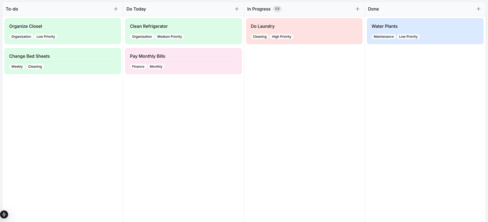
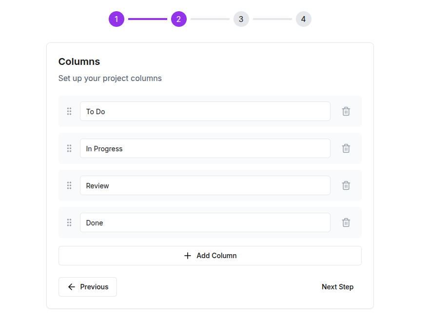
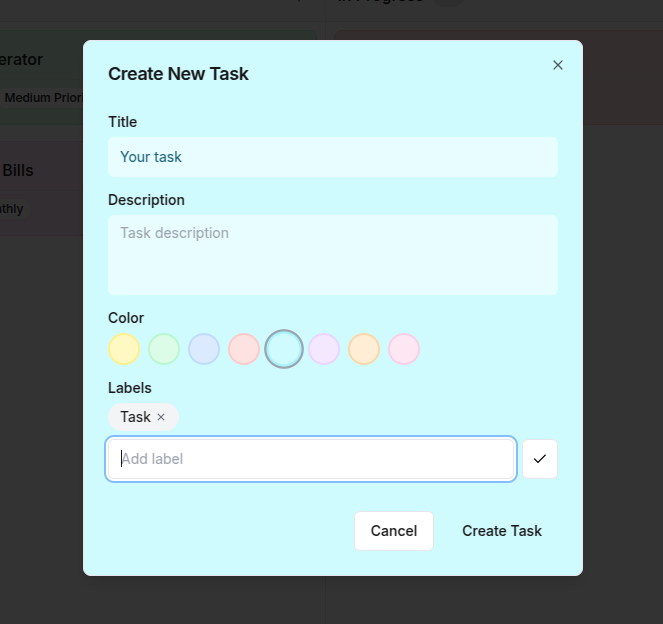

# KanbanLife

Welcome to KanbanLife - Your Intuitive Project Management Solution!



KanbanLife is a powerful yet simple project management tool that helps you organize your tasks and projects efficiently. With our intuitive interface, you can easily create, manage, and track your projects in a visual way.

## Create Projects with Ease



Creating a new project is straightforward:
- Give your project a name
- Set a description
- Choose your preferred columns
- Start organizing your tasks immediately

## Customize Your Tasks



Easily create and customize tasks:
- Add detailed descriptions
- Set priorities
- Track progress
- Move tasks between columns with drag and drop

## Getting Started

### Prerequisites

- Node.js 18+ installed
- NPM or Yarn
- Backend running on port 3333 (or adjust URL in .env.local)

### Installation

1. Install dependencies:
```bash
npm install
```

2. Configure environment:
- Copy `.env.local.example` to `.env.local`
- Adjust API URL if needed

3. Run development server:
```bash
npm run dev
```

4. Access the project:
- Frontend: http://localhost:3000
- API should be running at http://localhost:3333

## Project Structure

- `src/app/` - Pages and routes (Next.js App Router)
- `src/components/` - Reusable React components
- `src/domain/` - Types and interfaces
- `src/hooks/` - Custom hooks
- `src/services/` - Services and integrations
- `src/stores/` - State management

